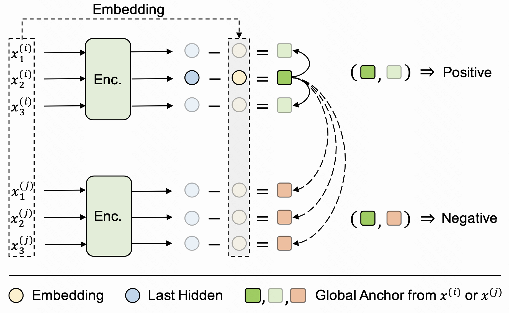

#  TACO
Code for the ACL 2022 paper "Contextual Representation Learning beyond Masked Language Modeling"


### What is TACO?

In brief, **T**oken-**A**lignment **C**ontrastive **O**bjective (TACO) is a simple yet effective language representation learning approach to directly model global semantics when generating contextualized representations. Concretely, TACO consists of two objectives:

1. the main pre-training objective, like MLM, learns basic representations for tokens. 
2. the **token-level contrastive objective**, TC loss for short, extracts and aligns contextual semantics hidden in those contextualized representations.

With such MTL-style objectives, the model is able to learn not only the local meanings of tokens but also the global semantics of tokens. Our experiments show that, with the help of TC loss, TACO achieves up to **5x** speedup (1/5 pre-training steps) while obtaining better results on the GLUE benchmark compared to MLMs.  


Here is the illustration of our proposed TC loss:



where $x^{(i)}$ and $x^{(j)}$ are natural language token sequences, such as sentences, from a text corpus. We take transformers as the encoder and it generates contextualized representations for all tokens. Then, the TC loss improves the representation quality by requiring all tokens from nearby positions to have a similar global semantic. To simplify, we take the simplest implementation, element-wise subtraction, to model the global part.
$$
g_i=enc(x)_i-x_i
$$
Finally, the TC loss formulates as follows,
$$
\begin{equation}
  \mathcal{L}(g^{(i)}_{t1},g^{(i)}_{t2}) = -\mathbb{E} \left[ \log\frac{exp(cos(g^{(i)}_{t1},g^{(i)}_{t2})/\tau)}{exp(cos(g^{(i)}_{t1},g^{(i)}_{t2})/\tau) + \sum_{k=1}^{K}exp(cos(g^{(i)}_{t1},g^{(j)}_{tk})/\tau)}\right] 
\end{equation}
$$
$g^{(i)}_{t1}$ and $g^{(i)}_{t2}$ are global semantics extracted from the same token sequence $x^{(i)}$, where $0<|t1-t2|<W$ and $W$ is the positive window size.  $g^{(j)}_{tk}$ is the global semantic extracted from other token sequences in the batch. Both positive $g^{(i)}_{t2}$  and negative $g^{(j)}_{tk}$  are randomly sampled on the fly. $K$ is the positive number and $\tau$ is the temperature hyper-parameter. In our implementation, we take each token's global semantic $g_i$ as the anchor once, and the overall loss can be written as follows:
$$
\begin{equation}
\mathcal{L}_{\text{TC}} = \frac1N\sum_{i=1}^N\frac1L\sum_{l=1}^L\mathcal{L}(g^{(i)}_l, g^{(i)}_{l'\ne l})\\
\mathcal{L}_{\text{TACO}}=\mathcal{L}_{\text{TC}} + \mathcal{L}_{\text{MLM}} \\
\end{equation}
$$


### Requirements

Our implementation is based on Huggingface with PyTorch backend. Moreover, the pre-training and GLUE datasets are obtained from Huggingface. Basic requirements:

- Python >= 3.8
- Pytorch >= 1.10.0

You can create a new conda environment for TACO like this:

```shell
conda create -n taco python=3.8
conda activate taco
conda install pytorch cudatoolkit=11.3 -c torch
```

Install transformer from source code:

```shell
cd transformers-master
python3 -m pip install .
cd ..
```

Install extra requirements for MLM tasks:

```shell
cd transformers-master/examples/pytorch/language-modeling
python3 -m pip install -r requirements.txt
cd -
```


### Preparation

When pre-training from scratch, we need to initialize the models according to the standard configurations. You can download the official configuration files from google. 

Small model:

```shell
mkdir bert_small
cd bert_small
wget https://storage.googleapis.com/bert_models/2020_02_20/uncased_L-4_H-512_A-8.zip
unzip uncased_L-4_H-512_A-8.zip
cd ..
```

Base model:

```shell
mkdir bert_base
cd bert_base
wget https://storage.googleapis.com/bert_models/2020_02_20/uncased_L-12_H-768_A-12.zip
unzip uncased_L-12_H-768_A-12.zip
cd ..
```

- see more configurations at https://github.com/google-research/bert

The pre-training datasets include **Wikipedia** and **Bookscorpus**. The script will help you download them automatically when you run the pre-training code for the first time.


### Pre-training

Next, we introduce how to train a small BERT or small TACO model. Training base models, MLMs, and other TACO variants are similar.

Run the command below to train a BERT-small model from scratch:

```shell
bash train_small.sh mlm saved_mlm_small_models 10 128 4 256 1000000 10000 10000 True processed_dateset
```

- **mlm**: model mode, you can choose from mlm and taco
- **saved_mlm_small_models**: where to store the pre-trained models
- **128**: PER_GPU_BS
- **4**: GRAD_ACC
- **256**: MAX_SEQ_LEN, which impacts the max sequence length when preprocessing

When you first time run the command, the script will automatically install the tokenization toolkit, then download and preprocess the datasets for you. Downloading English Wikipedia and BooksCorpus datasets takes around 1h, but preprocessing them might take more than 12h. The script will save the processed dataset to the local disk to avoid repeated processing every time, but remember to re-processed them when you need to change MAX_SEQ_LEN.

It is also easy to train a TACO-small model from scratch like this:

```shell
bash train_small.sh taco saved_taco_small_models 10 128 4 256 1000000 10000 10000 True processed_dateset 50 5 0.07
```

The meanings of the last three parameters are:

- **50**: the number of negative samples
- **5**: the positive sample window size
- **0.07**: temperature parameter

See the corresponding script for more details. 


### Fine-tuning

Run the command below to finetune a GLUE task based on the pre-trained checkpoint:

```shell
bash finetune_small.sh ./pretrain_results/saved_small_models/checkpoint-100000 rte 128 16 5e-5 4 100 123
```

- **rte**: GLUE task name
- **128**: max sequence length
- **16**: batch size per GPU
- **5e-5**: learning rate

Please refer to the Appendix in the paper for more pre-training and fine-tuning details.


### Citation

```bibtex
@inproceedings{fu-etal-2022-contextual,
    title = "Contextual Representation Learning beyond Masked Language Modeling",
    author = "Fu, Zhiyi  and
      Zhou, Wangchunshu  and
      Xu, Jingjing  and
      Zhou, Hao  and
      Li, Lei",
    booktitle = "Proceedings of the 60th Annual Meeting of the Association for Computational Linguistics (Volume 1: Long Papers)",
    month = may,
    year = "2022",
    address = "Dublin, Ireland",
    publisher = "Association for Computational Linguistics",
    url = "https://aclanthology.org/2022.acl-long.193",
    doi = "10.18653/v1/2022.acl-long.193",
    pages = "2701--2714",
}
```

